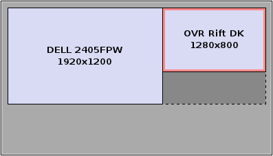

# OculusGlfwSkeleton

## Description

A cross-platform multi-window app skeleton to use as a starting point for native VR app development with OpenGL. A convenient interface for tweaking common VR display parameters.

## Setup

### Windows

Use the **Screen Resolution** control panel to set your monitors' orientations to match the above image. **Winkey-P** is a quick shortcut to toggle Extended and Mirrored modes.

### Linux

Use **nvidia-settings** or equivalent to set your monitors' orientations to match the above image(e.g. 1280x800 +1920+0).

## Build (skip if you've got an exe)

### Windows

    Create the directory build/ in project's home(alongside CMakeLists.txt)
    Shift+right-click it in Explorer->"Open command window here"
    build> cmake ..
    Double-click the only .sln file in build to open it in Visual Studio
    Right-click the GLSkeleton project in Solution Explorer, "Set as StartUp Project"
    Press F7 to build, F5 to build and run

### Linux

    $> mkdir build
    $> cd build
    $> cmake .. && make
    $> ./GLSkeleton

## Usage

Upon launching the app, a control view window is created. If a second display of resolution 1280x800 is detected, a second window will be created on it. The first window(Control window) will accept keyboard and mouse input and changes will automatically be reflected in the second(Rift window).

- Left-click and drag to adjust viewing direction in the absence of a Rift with head tracker
- Right-click and drag to move avatar location 
- Mouse wheel to zoom Third Person Camera

### Keys
- z - Toggle display in control window
- F1 - Cycle display mode of first window(normal, stereo, stereo with distortion)
- F2 - Cycle display mode of second window if present

## Thanks

- elmindreda for the awesome [Glfw3 framework](https://github.com/glfw/glfw) which makes multi-window GL apps possible 
- Palmer Luckey and Oculus for the [Oculus Rift and OVR SDK](http://www.oculusvr.com/)
- Philip Rideout for the [excellent CMake/OpenGL code](http://github.prideout.net/)
- Philippe Decaudin for [AntTweakBar](http://anttweakbar.sourceforge.net/doc/)
- Milan Ikits and Marcelo Magallon for [GLEW](http://glew.sourceforge.net/)
